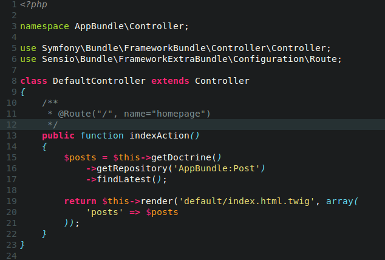

# gerardroche/sublime-molokai

A port of [tomasr/molokai](https://github.com/tomasr/molokai)) for Sublime Text 3.

## Overview

* [Installation](#installation)
* [Contributing](#contributing)
* [Changelog](#changelog)
* [License](#license)

## Installation

### [Package Control](https://packagecontrol.io) installation

This is the preferred method of installation.

Search for "molokai".

### Manual installation

1. Close Sublime Text.
2. Download or clone this repository to a directory named `molokai` in the Sublime Text Packages directory for your platform:
    * Linux: `git clone https://github.com/gerardroche/sublime-molokai.git ~/.config/sublime-text-3/Packages/molokai`
    * OS X: `git clone https://github.com/gerardroche/sublime-molokai.git ~/Library/Application\ Support/Sublime\ Text\ 3/Packages/molokai`
    * Windows: `git clone https://github.com/gerardroche/sublime-molokai.git %APPDATA%\Sublime/ Text/ 3/Packages/molokai`
3. The features listed above will be available the next time Sublime Text is started.

## Contributing

Your issue reports and pull requests are always welcome.

## Changelog

See [CHANGELOG.md](CHANGELOG.md).

## License

Released under the [BSD 3-Clause License](LICENSE).
