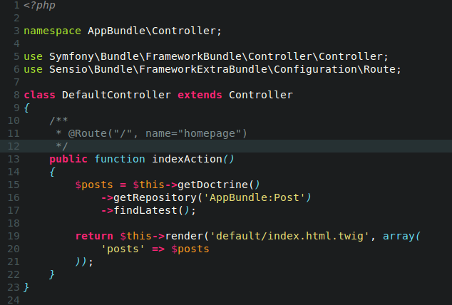
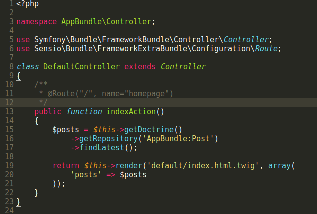
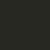
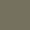
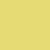
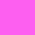
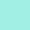
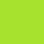

# Molokai

     

Port of [vim-molokai](https://github.com/tomasr/molokai) color scheme and a monokai classic variation for Sublime Text.

**Molokai**

**Monokai**

## OVERVIEW

* [Installation](#installation)
* [Contributing](#contributing)
* [Changelog](#changelog)
* [License](#license)

## INSTALLATION

### Package Control installation

The preferred method of installation is [Package Control](https://packagecontrol.io/browse/authors/gerardroche).

### Manual installation

1. Close Sublime Text.
2. Download or clone this repository to a directory named **`molokai`** in the Sublime Text Packages directory for your platform:
    * Linux: `git clone https://github.com/gerardroche/sublime-molokai.git ~/.config/sublime-text-3/Packages/molokai`
    * OS X: `git clone https://github.com/gerardroche/sublime-molokai.git ~/Library/Application\ Support/Sublime\ Text\ 3/Packages/molokai`
    * Windows: `git clone https://github.com/gerardroche/sublime-molokai.git %APPDATA%\Sublime/ Text/ 3/Packages/molokai`
3. Done!

## CONTRIBUTING

Please open issues, even for what might seem like a trivial issues. The package has a test suite for testing the color schemes so it's easy enough to fix issues.

Your issue reports and pull requests are always welcome.

### The color specs

#### Molokai

#### Monokai

**Background Tones**

Base03 | Base02
-------|-------
\#272822 |\#3e3d32
 | 

**Content Tones**

Base01 | Base0 | Base1
-------|-------|------
\#75715e | \#f8f8f2 | ?
 |  | ?

**Accents**

Yellow | Orange | Red | Magenta | Violet | Blue | Cyan | Green
-------|--------|-----|---------|--------|------|------|------
\#e6db74 | \#fd971f | \#f92672 | \#fd5ff0 | \#ae81ff | \#66d9ef | \#a1efe4 | \#a6e22e
 |  |  |  |  |  |  | 

**Usage**

*Usage is modelled on the [altercation/solarized](http://ethanschoonover.com/solarized) scheme.*

* Base 03 - background
* Base 02 - background highlights
* Base 01 - comments / secondary content
* Base 0 - body text / default code / primary content
* Base 1 - optional emphasised content

### Resources

* Emacs: [oneKelvinSmith/monokai-emacs](https://github.com/oneKelvinSmith/monokai-emacs)
* Emacs: [sjrmanning/darkokai](https://github.com/sjrmanning/darkokai) (dark variant)
* Atom: [kevinsawicki/monokai](https://github.com/kevinsawicki/monokai)
* Studio: [studiostyl.es/brighter-monokai-variant](http://studiostyl.es/schemes/brighter-monokai-variant)
* Terminal: [Mayccoll/Gogh](https://github.com/Mayccoll/Gogh/blob/master/content/themes.md#monokai-dark)

## CHANGELOG

See [CHANGELOG.md](CHANGELOG.md).

## LICENSE

Released under the [BSD 3-Clause License](LICENSE).
