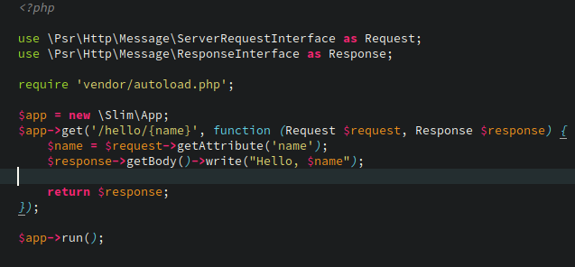

# molokai

A Sublime Text color scheme inspired by [vim-molokai](https://github.com/tomasr/molokai).

     

* Tested using [ColorSchemeUnit](https://github.com/gerardroche/sublime_color_scheme_unit)
* Supported plugins: [GitGutter](https://github.com/jisaacks/GitGutter), [SublimeLinter](https://github.com/SublimeLinter/SublimeLinter3), [NeoVintageous](https://github.com/NeoVintageous/NeoVintageous)

[ColorSchemeUnit](https://github.com/gerardroche/sublime_color_scheme_unit), which is a testing framework for Sublime Text color schemes, helps improve the quality of color schemes and prevent regressions.

**The Monokai color scheme has been moved to [MonokaiFree](https://github.com/gerardroche/sublime-monokai-free).**

## INSTALLATION

### Package Control installation

The preferred method of installation is [Package Control](https://packagecontrol.io/browse/authors/gerardroche).

### Manual installation

1. Close Sublime Text.
2. Download or clone this repository to a directory named **`molokai`** in the Sublime Text Packages directory for your platform:
    * Linux: `git clone https://github.com/gerardroche/sublime-molokai.git ~/.config/sublime-text-3/Packages/molokai`
    * OS X: `git clone https://github.com/gerardroche/sublime-molokai.git ~/Library/Application\ Support/Sublime\ Text\ 3/Packages/molokai`
    * Windows: `git clone https://github.com/gerardroche/sublime-molokai.git %APPDATA%\Sublime/ Text/ 3/Packages/molokai`
3. Done!

## CONTRIBUTING

Your issue reports and pull requests are always welcome.

### Tests

To run the tests: install [ColorSchemeUnit](https://github.com/gerardroche/sublime_color_scheme_unit), which a testing framework for ST color schemes, open the Command Palette, type "ColorSchemeUnit: Test Suite", and press Enter.

## LICENSE

Released under the [BSD 3-Clause License](LICENSE).
